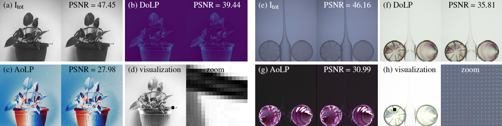
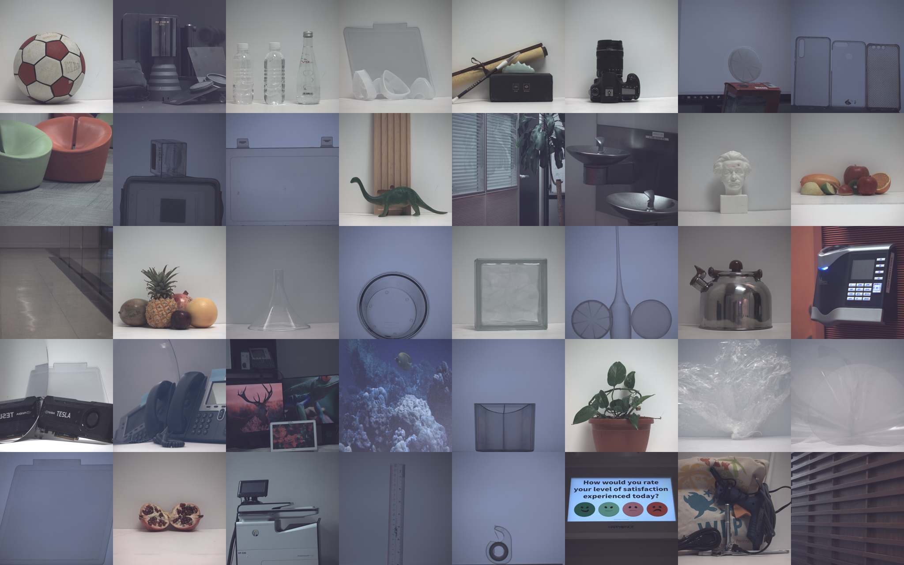

# Mono-and-Color Polarization Demosaicking

Code and dataset for paper: Polarization Demosaicking for Monochrome and Color Polarization Focal Plane Arrays

[Project Page](https://vccimaging.org/Publications/Simeng2019PolarizationDemosaic/) | [Paper](https://vccimaging.org/Publications/Simeng2019PolarizationDemosaic/Simeng2019PolarizationDemosaic.pdf) | [Supplementary](https://vccimaging.org/Publications/Simeng2019PolarizationDemosaic/Simeng2019PolarizationDemosaicSupplement.pdf)

This code is based on MATLAB.

## 

## Code Setup
Uplaod .mat file of scenes according to the dataset. Mono-polar and Color-polar demosaicking require different parameters.

## Dataset: 

## 

Dataset from [here](https://repository.kaust.edu.sa/handle/10754/631914) has two groups of images, normal illumination and polarized illumination. 
If your initial implementation is from "Mosic Intensities Images" at four different angles, please refer to this mosic dataset [here](https://drive.google.com/drive/u/1/folders/1_s8fBOqyJPBo4v7Hb9yyk4FCf-YfGXgQ) .

* Polarized illumination: 
|scotch
|plate
|glassplasticcomp
|glasscontainer
|cover
|penstand
|cellphonecases
|carrier
|ruler
|containers|

* Normal illumination:
|plant
|fakefruit
|dinosaur
|bottles
|ball
|pomegranate
|plastik
|mirrorcard
|tools
|plastikcomp
|mirrorphone
|glasscube
|funnel
|fruit2
|einstein
|camera
|caligraphset
|cablelid
|blackstuff
|kettle
|woodwall
|screen
|lock
|door
|chairs
|floor
|paint
|printer
|drinkingfountain
|monitors|
## Intensity Images (Ground Truth)
This work is start from solveing Stokes vectors. If your implementation is begin from mosic intensity images, just simply run our monochrome and color main code until "Inten_gt", which contains mosic intensiy images at four different degrees.
## Citation
Please cite this work if it helps your research:
```
@inproceedings {v.20191325,
booktitle = {Vision, Modeling and Visualization},
editor = {Schulz, Hans-Jörg and Teschner, Matthias and Wimmer, Michael},
title = ,
author = {Qiu, Simeng and Fu, Qiang and Wang, Congli and Heidrich, Wolfgang },
year = {2019},
publisher = {The Eurographics Association},
ISBN = {978-3-03868-098-7},
DOI = {10.2312/vmv.20191325}
}
```

## Contact
If you have related questions, please contact: Simeng Qiu (<simeng.qiu@kaust.edu.sa>)
